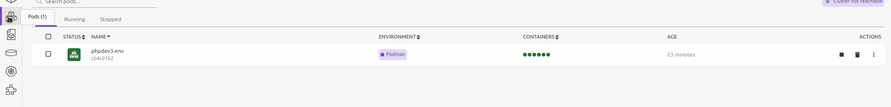
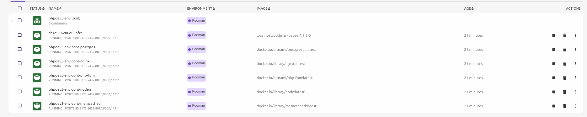

# What is This?
- This is a Dev Environment for PHP using PODMAN pods an alternative to docker.


## Why PODMAN?
- Well for me, it's More lighter and is deamonless


## Podman must be installed!
- https://podman.io/

## Podman Registries must be set
```
unqualified-search-registries = ['docker.io','ghrc.io','quay.io']
```
- can be added to the following files:
- Option 1: create or update `$HOME/.config/containers/registries.conf`
- Option 2: update `/etc/containers/registries.conf`
- i would prefer the option 1 for cleaner

## How To Use


### Manual Download
- copy the `init.sh` on your directory
- using curl
- `curl https://github.com/tomexsans/podman-phpdev/blob/main/init.sh > init.sh`
- using wget
- `wget https://github.com/tomexsans/podman-phpdev/blob/main/init.sh`
- make it executable `chmod +x init.sh`
- execute the file `bash init.sh` or `./init.sh`

### Podman-compose
- if you don't want to create a pod a `podman-compos.yml` file is available just run `podman compose up -d`
- ensure `podman-compose` and `docker-compose` is installed on your system


## NGINX not Running after init.sh?
- after the `init.sh` nginx may be down because of dependencies which are not yet done loading.
- Just start it manually


## Check
```bash
# list running
podman ps

# List pods
podman pod list

# want to enter a container?
podman exec -ti <container name> bash

```


## Tired of CLI? Try Using Podman desktop
- Podman has a GUI https://podman-desktop.io/




## POD wont start after HOST reboot
- the command `sudo sysctl net.ipv4.ip_unprivileged_port_start=80` is just for the current session
- a fix would be to add the config permanently

```bash
# open conf
sudo nano /etc/sysctl.conf
# Add this line to the end or check if it exists 
net.ipv4.ip_unprivileged_port_start=80
# restart systl
sudo sysctl -p
# check if exists
sysctl net.ipv4.ip_unprivileged_port_start
```

## license?
- Free to Use! 
- Free to Fork!
- Free to modify!
- Free to do what you want :D